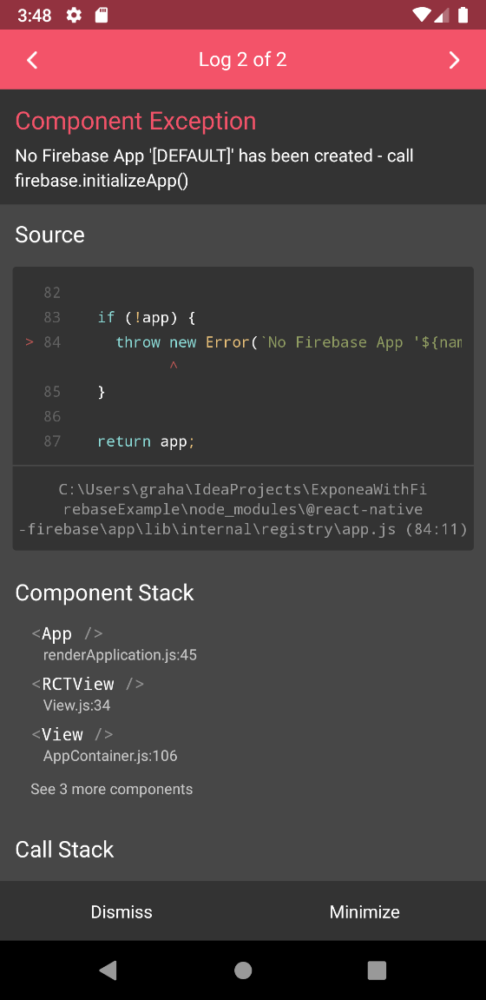

This app is a base react-native init-ed from CLI with these extra tweaks:
 
- these dependencies added:

```
"@react-native-firebase/analytics": "7.4.1",
"@react-native-firebase/app": "8.3.0",
"@react-native-firebase/crashlytics": "8.3.0",
"@react-native-firebase/iid": "7.3.1",
"@react-native-firebase/perf": "7.3.1",
"react-native-exponea-sdk": "0.2.0"
```
- multiDex enabled
- Exponea configuration in `index.js`
- Firebase setup + basic analytics call in App.js
- upgrade gradle to 3.6.0 so build actually builds...

Change can be found searching for `/** MODIFICATION TO BASE REACT-NATIVE INIT **/`

Tested on Pixel 3a AVD API level 28 w/ Google Play

## Replication steps:

- (optional) `adb shell setprop debug.firebase.analytics.app com.exponeawithfirebaseexample` to turn on firebase debug for this app so DebugView works
- `yarn install`
- copy a valid `google-services.json` to `android/app/google-services.json` after setting up Firebase
- put valid tokens for Exponea in `index.js`
- `yarn start` and `yarn android`

This produces this error on app init:



## Workaround

- Uncomment code in `android/app/src/main/java/com/exponeawithfirebaseexample/MainApplication.java` forcing a `[DEFAULT]` app init
- App now loads fine!
